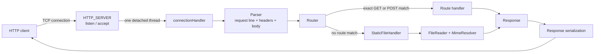

# http-server

A small, educational HTTP server written in C++20 with POSIX sockets. It listens on port `8989`, accepts TCP connections, parses one HTTP request per connection, dispatches simple `GET` and `POST` routes, and falls back to serving files from `assets/`.

The executable currently exposes a small JSON API at `/` and serves the bundled image and `404.html` page as static content. It is a learning project, not a production web server.

## What it does

- Opens a TCP listening socket with `SO_REUSEADDR` and a listen backlog of 10.
- Creates a detached `std::thread` for each accepted client.
- Parses an HTTP request line, headers, and a request body when `Content-Length` is present.
- Registers exact-match `GET` and `POST` handlers.
- Serves unmatched `GET` and `POST` paths from the configured static root.
- Reads files in binary mode and resolves common MIME types.
- Uses canonical filesystem paths to reject requests that resolve outside the static root, including traversal and symlink escapes.
- Returns `assets/404.html` when a requested static file is missing or rejected.

## Architecture



### Request handling

```text
request bytes
    -> read until the header terminator is found
    -> parse request line and headers
    -> if Content-Length is present, read the remaining body bytes
    -> route or serve a static file
    -> serialize one HTTP response and close the client socket
```

## Included endpoints

| Request | Behavior |
|---|---|
| `GET /` | Returns a hard-coded JSON array of three users. |
| `POST /` with `Content-Type: application/json` | Parses JSON and returns `200` with `{"message" : "JSON recieved"}`. |
| `POST /` with malformed JSON | Returns `400` with an error JSON body. |
| `GET /images/anime-bg.png` | Serves the bundled PNG from `assets/images/`. |
| Unknown/static path | Returns the custom `assets/404.html` page with `404`. |

Static files are not registered individually: an unmatched route is mapped below the static root.

## Build

Requirements:

- A POSIX-compatible system (the server uses POSIX socket APIs).
- CMake 3.20 or newer.
- A C++20-capable compiler.

```bash
cmake -S . -B build
cmake --build build
./build/http-server
```

The server listens on `http://127.0.0.1:8989` (on all local interfaces via `INADDR_ANY`).

> **Current configuration note:** `src/main.cpp` hard-codes the static directory as `/home/akumaa/Projects/http-server/assets`. If you clone the project elsewhere, update that path before running the executable.

## Try it

```bash
# JSON route
curl -i http://127.0.0.1:8989/

# Valid JSON POST
curl -i -X POST http://127.0.0.1:8989/ \
  -H 'Content-Type: application/json' \
  --data '{"name":"test","email":"test@example.com"}'

# Static asset
curl -sS -D - http://127.0.0.1:8989/images/anime-bg.png -o /dev/null

# Missing resource
curl -i http://127.0.0.1:8989/does-not-exist
```

## Project layout

```text
.
├── assets/                    # Static files and custom 404 page
├── include/                   # Public declarations for server components
├── src/
│   ├── main.cpp               # Routes, port, and static-root setup
│   ├── Http_Server.cpp        # Socket lifecycle and connection handling
│   ├── Http_Parser.cpp        # Request-line and header parsing
│   ├── router.cpp             # Exact route dispatch and static fallback
│   ├── StaticFileHandler.cpp  # Static-root validation and file responses
│   ├── FileReader.cpp         # Binary file reads
│   ├── MimeResolver.cpp       # File extension to MIME type mapping
│   └── Http_Response.cpp      # Response-body and header helpers
├── CMakeLists.txt
└── README.md
```

## Static-file safety

The static-file handler removes leading slashes, joins the requested path to the configured root, then uses `std::filesystem::weakly_canonical`. It compares path components—not string prefixes—to ensure the resolved file remains within the canonical static root. This prevents `..` traversal, similarly prefixed directories, and symlinks that escape the root.

## Current limitations

These are implementation constraints worth knowing before using the project beyond experimentation:

- It serves one request per connection; keep-alive and pipelined requests are not supported.
- It uses unbounded detached threads, so it is not suited to high concurrency.
- It supports only the implemented `GET` and `POST` routing paths; unsupported methods do not receive a deliberate `405 Method Not Allowed` response.
- It does not implement chunked transfer encoding, request-size limits, timeouts, TLS, or comprehensive HTTP/1.1 validation.
- Header values are converted to lowercase during parsing, which is convenient for the current content-type check but is not correct for every HTTP header value.
- A header delimiter split across socket reads is not reliably handled: the receive loop checks each new chunk for `\r\n\r\n` before accumulating it.
- Responses are sent with one `send()` call and the return value is not checked, so partial writes are not handled.
- The unsupported-content-type branch sets status `415`, but the response reason-phrase map does not yet include it and currently serializes it as `Internal Server Error`.
- Middleware can be registered with `Router::use`, but is not invoked by the router yet.

## Next steps

- Make the static root configurable instead of hard-coding a developer-specific path.
- Replace detached threads with a bounded thread pool or event-driven I/O.
- Make request parsing incremental and robust across arbitrary TCP chunk boundaries.
- Add proper response write loops, HTTP error handling, and request limits.
- Add automated tests for routing, static-path containment, parsing, and response serialization.
