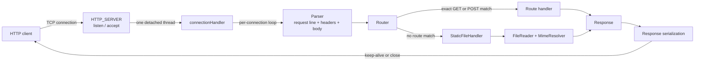

# http-server

A small HTTP server in C++20 with POSIX sockets. It accepts TCP connections, speaks HTTP/1.1 (including keep-alive), and dispatches requests through an Express-style router: you register `GET` and `POST` handlers, and unmatched paths fall through to static file serving.

The current binary listens on port `8989`, exposes a JSON API at `/`, and serves files from `assets/`. It is a learning project, not a production web server.

## What it does

- **HTTP/1.1 server.** Listens with `SO_REUSEADDR`, accepts clients on detached threads, parses request line, headers, and `Content-Length` bodies, and keeps connections open unless `Connection: close` is sent.
- **Express-style routing.** `Router::get` / `Router::post` register exact-match handlers, the same idea as `app.get` / `app.post` in Express. The first matching route handles the request; there is no parameterized path matching yet.
- **Static file serving.** Paths that do not match a route are served from a static root, with MIME types resolved from file extensions. Missing files return `assets/404.html`.
- **Directory-traversal protection.** The static handler canonicalizes the requested path and rejects anything that would escape the static root, including `..` segments, similarly prefixed directories, and symlink escapes.

The static root is currently a hardcoded path in `src/main.cpp` (`/home/akumaa/Projects/http-server/assets`). If you clone the project elsewhere, change that path before running.

## Architecture


```mermaid
flowchart LR
    C[HTTP client] -->|TCP connection| L[HTTP_SERVER\nlisten / accept]
    L -->|one detached thread| H[connectionHandler]
    H -->|per-connection loop| P[Parser\nrequest line + headers + body]
    P --> R[Router]
    R -->|exact GET or POST match| A[Route handler]
    R -->|no route match| S[StaticFileHandler]
    S --> F[FileReader + MimeResolver]
    A --> O[Response]
    F --> O
    O --> X[Response serialization]
    X -->|keep-alive or close| C
```

### Request handling

```text
connection accepted
    -> loop:
        read until the header terminator is found (including leftover bytes)
        parse request line and headers
        if Content-Length is present, read the remaining body bytes
        keep extra buffered/pipelined bytes for the next request
        route or serve a static file
        serialize a response with Connection and Content-Length
        close only on Connection: close, HTTP/1.0 without keep-alive, or I/O error
```

## Included endpoints

| Request | Behavior |
|---|---|
| `GET /` | Returns a hard-coded JSON array of three users. |
| `POST /` with `Content-Type: application/json` | Parses JSON and returns `200` with `{"message" : "JSON recieved"}`. |
| `POST /` with malformed JSON | Returns `400` with an error JSON body. |
| `GET /images/anime-bg.png` | Serves the bundled PNG from `assets/images/`. |
| Unknown/static path | Returns the custom `assets/404.html` page with `404`. |

Static files are not registered individually. An unmatched `GET` or `POST` is resolved under the static root, after the traversal checks above.

Routing looks like Express: register handlers on a `Router`, then pass it to the server.

```cpp
Router myRouter("/path/to/assets");
myRouter.get("/", [](const Request &req, Response &res) {
    res.status(200);
    res.setContentType("application/json");
    res.setBody(R"({"message": "hello"})");
});
HTTP_SERVER app(8989, myRouter);
app.run();
```

## Build

Requirements:

- A POSIX-compatible system (the server uses POSIX socket APIs).
- CMake 3.20 or newer.
- A C++20-capable compiler.

```bash
cmake -S . -B build
cmake --build build
./build/http-server
```

The server listens on `http://127.0.0.1:8989` (on all local interfaces via `INADDR_ANY`). Update the hardcoded static-root path in `src/main.cpp` if the project does not live at `/home/akumaa/Projects/http-server`.

## Try it

```bash
# JSON route
curl -i http://127.0.0.1:8989/

# Valid JSON POST
curl -i -X POST http://127.0.0.1:8989/ \
  -H 'Content-Type: application/json' \
  --data '{"name":"test","email":"test@example.com"}'

# Static asset
curl -sS -D - http://127.0.0.1:8989/images/anime-bg.png -o /dev/null

# Missing resource
curl -i http://127.0.0.1:8989/does-not-exist
```

## Project layout

```text
.
├── assets/                    # Static files and custom 404 page
├── include/                   # Public declarations for server components
├── src/
│   ├── main.cpp               # Routes, port, and static-root setup
│   ├── Http_Server.cpp        # Socket lifecycle and connection handling
│   ├── Http_Parser.cpp        # Request-line and header parsing
│   ├── router.cpp             # Exact route dispatch and static fallback
│   ├── StaticFileHandler.cpp  # Static-root validation and file responses
│   ├── FileReader.cpp         # Binary file reads
│   ├── MimeResolver.cpp       # File extension to MIME type mapping
│   └── Http_Response.cpp      # Response-body and header helpers
├── CMakeLists.txt
└── README.md
```

## Static-file safety

The static-file handler strips a leading slash, joins the request path to the static root, then uses `std::filesystem::weakly_canonical`. It compares path components—not string prefixes—so a resolved file must stay inside that root. That blocks directory-traversal attacks (`../etc/passwd`), lookalike directories that only share a prefix, and symlinks that point outside the root.

## Current limitations

These are implementation constraints worth knowing before using the project beyond experimentation:

- The static-file root is hardcoded in `src/main.cpp`; it is not a command-line or config option yet.
- Routing is exact-match `GET` / `POST` only. There are no Express-style path parameters (`/users/:id`), unsupported methods do not get a `405`, and `Router::use` middleware is registered but not invoked.
- It uses unbounded detached threads, so it is not suited to high concurrency.
- It does not implement chunked transfer encoding, request-size limits, timeouts, TLS, or comprehensive HTTP/1.1 validation.
- Header values are converted to lowercase during parsing, which is convenient for the current content-type check but is not correct for every HTTP header value.
- A header delimiter split across socket reads is not reliably handled: the receive loop checks each new chunk for `\r\n\r\n` before accumulating it.
- The unsupported-content-type branch sets status `415`, but the response reason-phrase map does not yet include it and currently serializes it as `Internal Server Error`.

## Next steps

- Make the static root configurable instead of hard-coding a developer-specific path.
- Replace detached threads with a bounded thread pool or event-driven I/O.
- Make request parsing incremental and robust across arbitrary TCP chunk boundaries.
- Add proper response write loops, HTTP error handling, and request limits.
- Add automated tests for routing, static-path containment, parsing, and response serialization.
